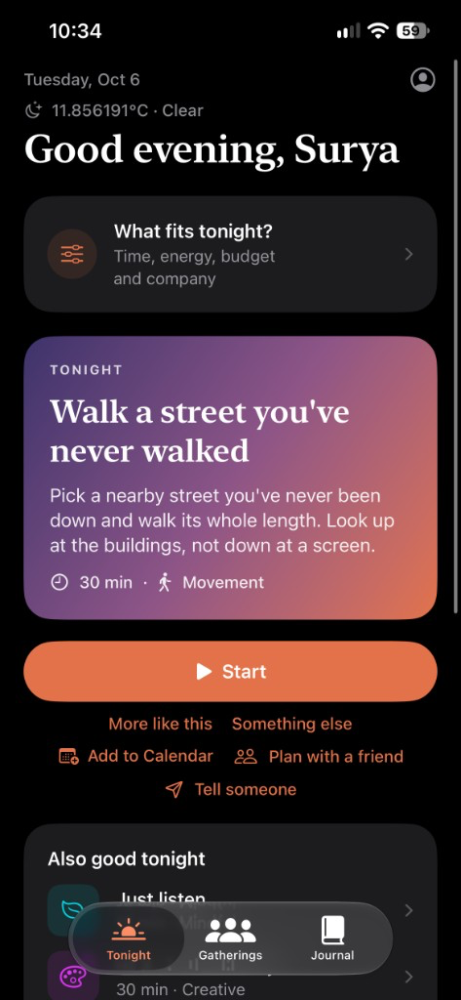
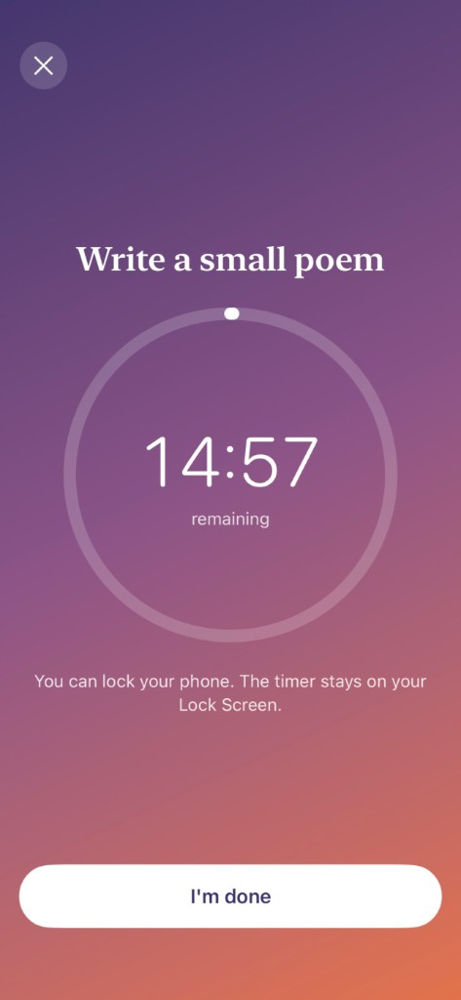
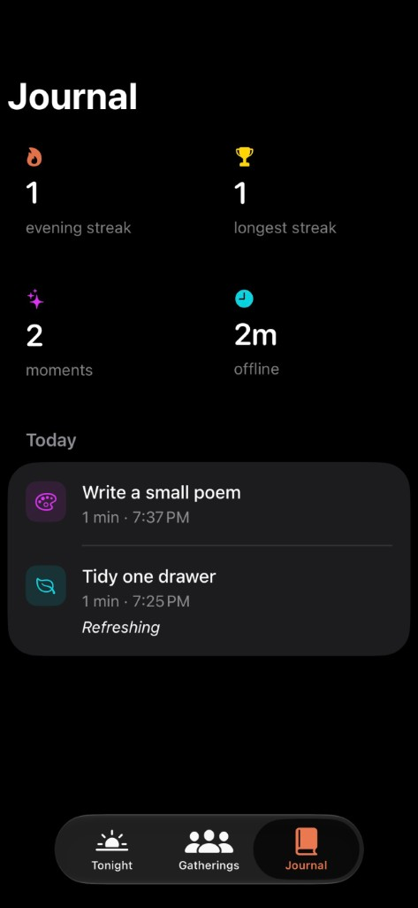
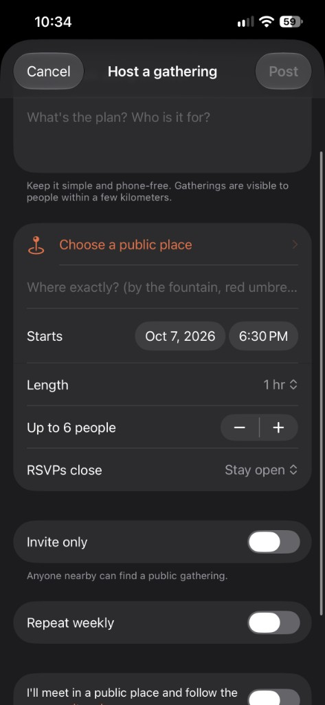
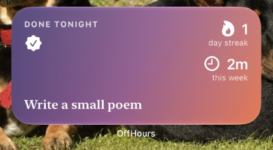

# OffHours

Reclaim the hour after work. Every evening OffHours suggests one small, phone-free thing to do,
points you to a real place nearby to do it, and lets neighbors host small gatherings.

A native iOS app built end to end by [Surya Nediyadeth](mailto:connect@suryanediyadeth.com):
product, design, SwiftUI client, Supabase backend, push infrastructure, moderation, and App Store
release.

<p align="center">
  
  
  
  
</p>
<p align="center">
  
</p>

## Highlights

- **Native SwiftUI on iOS 18** with Swift 6 strict concurrency, `@Observable` state, and no
  third-party UI code. The project is generated with XcodeGen.
- **WidgetKit and ActivityKit**: a Home Screen and Lock Screen widget that shares data with the
  app through an App Group, and a Live Activity countdown on the Lock Screen and Dynamic Island.
- **Context-aware suggestions**: picks are deterministic per person and day, so a notification
  scheduled days ahead matches what the app shows. WeatherKit and an on-device sunset calculation
  move outdoor ideas aside on rainy or dark evenings.
- **Real places, not a database of them**: MapKit finds the nearest park, café, library, museum or
  waterfront on device.
- **Supabase backend secured by row level security** on every table. Location-based queries,
  hosting limits, rate limits and two-way blocking are enforced in Postgres, not the client.
  The policies are covered by SQL tests that run against a throwaway database.
- **Server-side push with no third-party service**: Deno Edge Functions sign APNs requests with
  ES256 JWTs and send to sandbox or production devices as needed. They handle nearby-gathering
  alerts (at most one a day), join and cancellation notices, and moderator alerts.
- **App Store requirements built in**: Sign in with Apple with token revocation on account
  deletion, report and block on all user content, moderator tools, a privacy manifest, and a
  published privacy policy.

**Stack:** Swift 6, SwiftUI, WidgetKit, ActivityKit, MapKit, WeatherKit, Swift Testing ·
Supabase (Postgres, Auth, Edge Functions on Deno) · APNs

## What's in this repo

| Path | What it is |
| --- | --- |
| `ios/` | The native SwiftUI app and its widget extension (iOS 18+). This is what ships to the App Store. |
| `supabase/` | Migrations, row level security, Edge Functions, and database tests. |
| `docs/` | Privacy policy and terms, App Store listing copy, and screenshots. |
| `prototype/` | The original React web prototype the app grew out of, kept for reference. |

## How it works

- **Sign in with Apple** through Supabase Auth. No passwords.
- **Tonight**: a daily activity picked from a curated library based on your interests and nudge
  time. A four-part check-in tunes it to the time, energy, budget and company that fit right now.
  Skips and journal completions teach the picker over time. A skip can say why, and "More like
  this" favors that kind of plan. Settings can also keep evenings quieter, closer to home, indoor, or free.
  Check-ins and these preferences stay on the device. Activities that need a place (park, café, library, waterfront, museum) are anchored
  to the nearest real one using Apple Maps on device, with walking directions.
- **Timer and journal**: start the activity, lock your phone, get a notification when time is
  up, write one line about it. Streaks and totals come from your journal in Supabase.
- **Gatherings**: anyone can host a small meetup at a public place. Nearby people can join until
  it's full. Every gathering can be reported, and hosts can be blocked.
- **Local notifications**: one nudge a day naming that day's activity, plus a reminder an hour
  before gatherings you join.
- **Push alerts** through the `gathering-alerts` Edge Function: hosts hear when someone joins, and
  people who opt in hear about new gatherings within their distance, at most once a day. Opting
  in stores a location rounded to about 1 km; turning it off deletes it.
- **Tonight** also lists gatherings in the next 24 hours that you're going to or that are nearby.
- **Weather and sunset**: on wet, very cold or very hot evenings (Apple WeatherKit), and after
  dark, outdoor picks move behind indoor ones. Sunset is calculated on device and outdoor picks
  say when to head out. Without weather data the picks are unchanged.
- **Invite-only gatherings**: a host can hide a gathering from people nearby and share a
  6-character code. Each date of a weekly gathering has its own code.
- **Weekly gatherings**: hosts can repeat a gathering for 2 to 4 weeks. Each date has its own
  RSVPs; nearby people get one alert for the series, and hosts can cancel one date or all.
- **Gatherings in the journal**: after a gathering you joined, Tonight asks "How was it?" and
  logging it counts toward your streak.
- **Lock Screen and Home Screen**: the activity timer runs as a Live Activity (Lock Screen and
  Dynamic Island), and the `OffHoursWidgets` extension shows tonight's pick, your streak and
  minutes this week on the Home Screen and Lock Screen. The app shares what to show through the
  `group.com.suryanediyadeth.offhours` App Group.
- **Weekly recap**: a Sunday 7 PM local notification summarizing the week. The Journal can also share
  that week as a card.
- **Calendar**: Tonight and a gathering can be added to Apple Calendar. OffHours only writes that
  event and does not read the rest of the calendar.
- **Account deletion** in Settings removes the user and everything they own.

## First-time setup

### 1. Supabase

1. Create a project at [supabase.com](https://supabase.com).
2. In the SQL editor, run every file in `supabase/migrations/` in filename order (or
   `supabase db push` with the Supabase CLI). The app expects all of them. The last two are safe
   to run again if one stops partway.
3. **Authentication → Sign In / Providers → Apple**: enable it and add
   `com.suryanediyadeth.offhours` under *Client IDs*. Native sign-in doesn't need the secret key.
4. **Project Settings → API**: copy the project URL host and the anon (publishable) key.

### 2. Push notifications

1. In the [Apple Developer portal](https://developer.apple.com/account/resources/authkeys/list),
   create a key with **Apple Push Notifications service (APNs)** enabled and download the `.p8`.
   It works for both development and production.
2. Set the Edge Function secrets and deploy it:

```sh
supabase secrets set --project-ref <ref> \
  APNS_KEY_ID=<key id> APNS_TEAM_ID=72285WRA34 \
  APNS_TOPIC=com.suryanediyadeth.offhours APNS_PRIVATE_KEY="$(cat AuthKey_XXXX.p8)"
supabase functions deploy gathering-alerts --project-ref <ref>
```

Debug builds register their device token as `sandbox` and release builds as `production`, and the
function sends each to the matching APNs server.

3. Account deletion revokes Sign in with Apple, as Apple requires. Create a second key with
   **Sign in with Apple** enabled (primary App ID `com.suryanediyadeth.offhours`), then:

```sh
supabase secrets set --project-ref <ref> \
  SIWA_KEY_ID=<key id> SIWA_PRIVATE_KEY="$(cat AuthKey_YYYY.p8)"
supabase functions deploy delete-account --project-ref <ref>
```

Without these secrets accounts are still deleted, but the app stays listed under the user's
Apple ID settings.

### Moderation

Every gathering and host can be reported from the app. Moderators get a push for each report and
should act within 24 hours (App Store guideline 1.2). Add yourself once in the SQL editor:

```sql
insert into moderation.moderators (user_id) values ('<your user id from auth.users>');
```

Then work the queue from the SQL editor. These functions aren't reachable from the app:

```sql
select * from moderation.open_reports;
select moderation.hide_gathering('<gathering id>', 'Spam');
select moderation.ban_user('<user id>', 'Harassment');   -- cancels their gatherings, signs them out
select moderation.unban_user('<user id>');
select moderation.resolve_report('<report id>', 'No action needed');
```

Hosts can create up to 3 gatherings a day, have up to 5 upcoming, and schedule up to 30 days
ahead. A weekly series counts as one gathering toward those limits. People can file up to 10
reports a day.

### Usage numbers

The `insights` schema has read-only views over the whole database. Like `moderation`, it's only
reachable from the SQL editor:

```sql
select * from insights.totals;                 -- people, alerts opt-ins, gatherings, open reports
select * from insights.daily limit 14;         -- signups, active people, activities, minutes, RSVPs per day
select * from insights.retention;              -- % of each signup week still logging in weeks 1, 2 and 4
select * from insights.top_activities;         -- most-done activities in the last 30 days
```

### WeatherKit

Tonight's weather comes from WeatherKit, so the App ID needs it enabled in two places in the
[developer portal](https://developer.apple.com/account/resources/identifiers/list): under
**Capabilities** (automatic signing turns this on) and under **App Services**. Data can take up to
30 minutes to start working after you enable it. Until then the app falls back to sunset only.

### 3. App secrets

```sh
cp ios/OffHours/Config/Secrets.example.xcconfig ios/OffHours/Config/Secrets.xcconfig
```

Fill in `SUPABASE_HOST` (for example `abcd1234.supabase.co`, without `https://`) and
`SUPABASE_ANON_KEY`. The file is git-ignored.

### 4. Xcode

```sh
brew install xcodegen      # only needed if you change ios/project.yml
cd ios && xcodegen generate
open OffHours.xcodeproj
```

Signing uses team `72285WRA34` with automatic provisioning. On first run on a device Xcode
registers the bundle ID with the Sign in with Apple and Push Notifications capabilities.

## Tests

```sh
# Swift unit tests (streaks, daily picks, sunset, weather re-ranking, weekly recap, widget)
cd ios && xcodebuild test -project OffHours.xcodeproj -scheme OffHours \
  -destination 'platform=iOS Simulator,name=iPhone 17'

# Database policies against a throwaway local Postgres
supabase/tests/run.sh
```

## Releasing

1. The privacy policy and terms are published from `docs/legal/site` to the public repo
   [Surya7612/offhours-legal](https://github.com/Surya7612/offhours-legal) at
   <https://surya7612.github.io/offhours-legal/>. After editing them, copy the folder over and push
   that repo.
2. The App Store Connect record exists: bundle ID `com.suryanediyadeth.offhours`, Apple ID
   `6819096557` (set as `AppConfig.appStoreID`, used for share links), category Lifestyle.
3. Privacy nutrition label: Name, Email, User ID, Device ID (push token), Coarse Location and
   Other User Content, all linked to the user, used for app functionality, not used for tracking.
   This matches `PrivacyInfo.xcprivacy`.
4. Review notes: give the reviewer a test Apple ID or explain that sign-in is Apple-only, and
   mention that moderators are notified of every report and act on it within 24 hours.
5. Bump `MARKETING_VERSION` in `ios/project.yml` for a new version (build numbers are bumped
   automatically on upload), then archive and upload from the command line:

```sh
cd ios
xcodebuild archive -project OffHours.xcodeproj -scheme OffHours -configuration Release \
  -destination 'generic/platform=iOS' -archivePath /tmp/OffHours.xcarchive \
  -allowProvisioningUpdates -clonedSourcePackagesDirPath ../.spm
xcodebuild -exportArchive -archivePath /tmp/OffHours.xcarchive \
  -exportOptionsPlist ExportOptions.plist -exportPath /tmp/OffHoursExport -allowProvisioningUpdates
```

   Or use Product → Archive in Xcode and Distribute App. The build shows up in TestFlight once
   Apple finishes processing it.

Regenerate the app icon with `swift ios/Tools/MakeIcon.swift ios/OffHours/Resources/Assets.xcassets/AppIcon.appiconset/AppIcon.png`.

## License

© 2026 Surya Nediyadeth. All rights reserved. The source is public to read and learn from; it
isn't licensed for reuse or redistribution.
